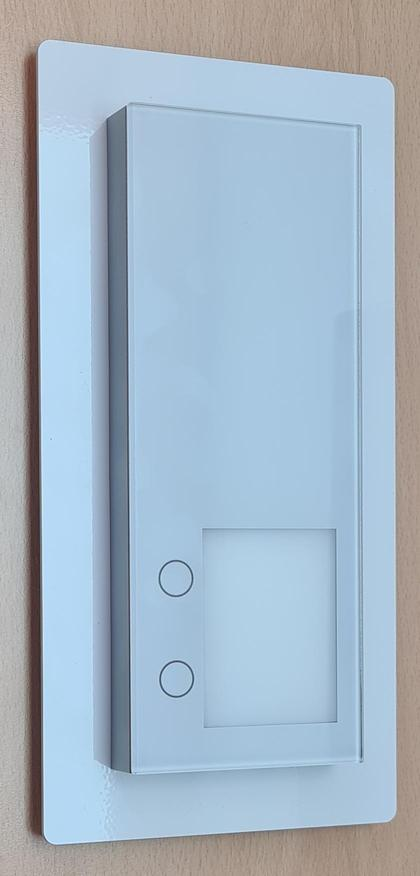
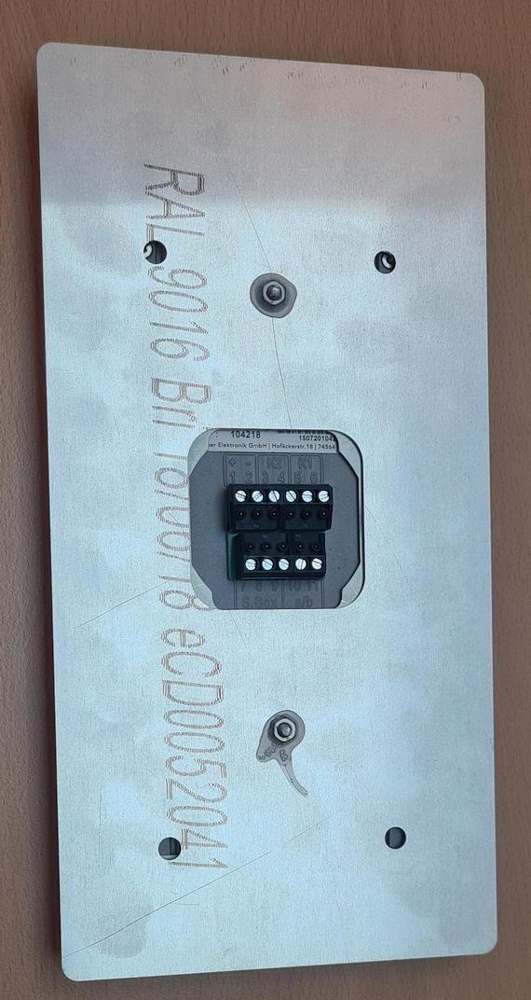
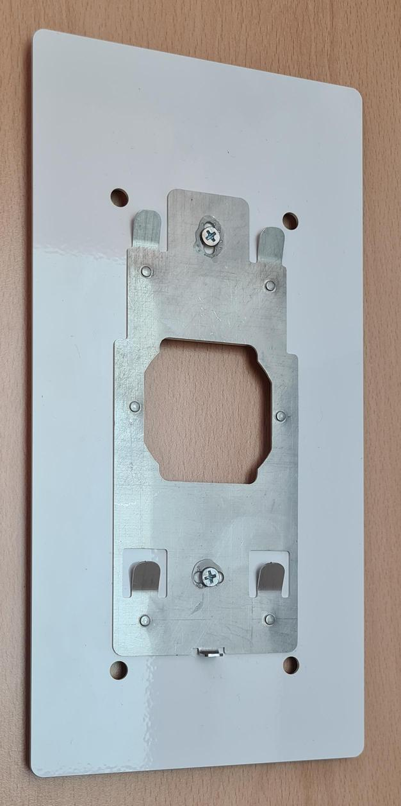
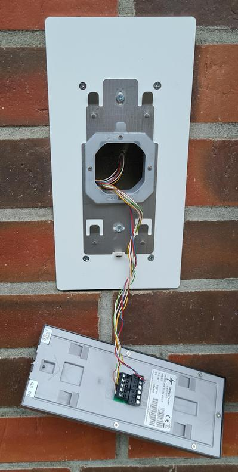
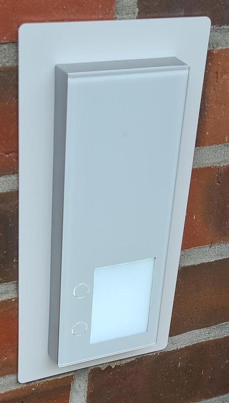

# DoorLine/Siedle-Adapter

Das hier vorgestellte Adapterblech dient der Montage einer [DoorLine](https://www.doorline-tuersprechanlagen.de) [Slim (DECT)](https://www.doorline-tuersprechanlagen.de/produkte/tuersprechanlagen/slim-dect/64/doorline-slim-dect) Türsprechstelle auf ein [Siedle](https://www.siedle.de) Unterputz-Gehäuse 100x200 mm.

Dieses Projekt stellt eine [FreeCAD](https://www.freecad.org/index.php?lang=de)-Zeichnung und zur Fertigung eine DXF-Datei bereit.
Mit Hilfe der DXF-Datei lässt sich das Adapterblech bei diversen Frontplatten-Herstellern z.B. [Beta LAYOUT](https://de.beta-layout.com/frontplatten/) bei überschaubaren finanziellen Aufwand (unter 100€ für ein Stück) fertigen.
Die Frontplatten lassen sich üblicherweise in verschiedenen Farben, Stärken, Ausführungen und Qualitäten bestellen.
Ein geübter FreeCAD-Benutzer kann Form und Maße den eigenen Wünschen anpassen und z.B. auch Gravuren und Ausfräsungen usw. hinzufügen.

Fehler, Fragen und Verbesserungsvorschläge können gerne über GitHub Issues und Discussions rückgemeldet werden.
